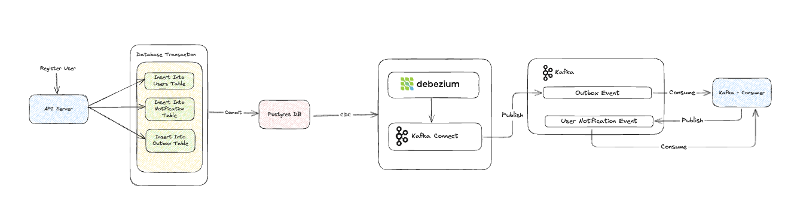

# Golang Debezium Outbox

This repository demonstrates the implementation of the Outbox Pattern using Golang and Debezium. The Outbox Pattern is a technique used to ensure reliable event-driven communication between microservices, particularly when using databases as the source of truth.

## Problem Statement

In microservices architecture, services often need to communicate with each other by publishing events. A common approach is to use a message broker (e.g., Kafka) to send events when a database transaction occurs. However, there is a challenge known as the **dual-write problem**, where:

1. The application writes data to the database.
2. The application sends an event to a message broker.

If one of these steps fails (e.g., the event is sent but the database transaction is rolled back, or vice versa), the system can enter an inconsistent state.

## Solution: Outbox Pattern with Debezium

The Outbox Pattern solves this problem by introducing an **Outbox Table** in the database, which acts as a buffer for events. Instead of directly publishing messages to Kafka, the application:

1. Saves the event in the outbox table within the same database transaction.
2. A CDC (Change Data Capture) tool like **Debezium** monitors the outbox table and publishes the events to Kafka.
3. A consumer service reads the messages from Kafka and processes them.

### Why Use Debezium Instead of Polling Data?

An alternative to Debezium is polling the outbox table at regular intervals to check for new records and then publishing them to Kafka. However, polling has several drawbacks:
- **Latency:** There is a delay between when the data is written and when it is processed, as polling occurs at fixed intervals.
- **Inefficiency:** Polling requires repeatedly querying the database, even when no new events exist, leading to unnecessary load.
- **Scalability Issues:** High-frequency polling can overload the database, while low-frequency polling increases event processing delays.

Debezium, on the other hand, listens for changes in real time using database transaction logs (WAL for PostgreSQL), ensuring:
- **Low Latency:** Events are captured and published immediately as they occur.
- **Efficiency:** No need for periodic database queries, reducing unnecessary load.
- **Scalability:** Works efficiently even under high transaction loads.

This approach ensures **atomicity**, meaning the database write and event publication occur together, preventing data inconsistencies.

Ex Pooling data : https://github.com/farisdewantoro/golang-atomic-outbox-asynq

## Project Overview

This project consists of two main services:


### 1. API Server (`api-server`)
This service handles user registration and generates notifications. It performs the following actions:
- Registers a new user.
- Creates a notification.
- Stores the outbox in the **outbox table** to process send notification.

### 2. Kafka Consumer (`kafka-consumer`)
This service listens for new events in the Kafka topic and processes them. It:
- Consumes messages from Kafka (published via Debezium).
- Processes notifications and executes the required business logic.

## Technologies Used
- **Go**: Backend programming language.
- **PostgreSQL**: Database to store users and outbox events.
- **Kafka**: Message broker for event streaming.
- **Debezium**: CDC tool to capture changes from the outbox table.
- **Docker & Docker Compose**: For containerized services.

## Getting Started

## Prerequisites

- Go 1.22 or higher
- GCC and build tools
- librdkafka C library

## Setup

1. Clone the repository:
```bash
git clone <repository-url>
cd golang-debezium-outbox
```

2. Run the setup command to install dependencies:
```bash
make setup
```

This will:
- Install required system dependencies (build-essential, pkg-config, librdkafka-dev)
- Set CGO_ENABLED=1
- Install Go dependencies
- Install Swagger CLI and generate documentation


## Swagger Documentation

The project includes Swagger/OpenAPI documentation. After running `make setup`, you can:

1. View the generated Swagger documentation at `docs/api/swagger.yaml` or `docs/api/swagger.json`
2. Access the generated API models in `internal/generated/api_models`

To regenerate the Swagger documentation:
```bash
make swagger
```

## Important Notes

- The project requires CGO to be enabled (CGO_ENABLED=1)
- Make sure you have the librdkafka-dev package installed
- If you encounter any build errors, try running `make setup` again
- Swagger CLI will be installed automatically during setup

## Troubleshooting

If you encounter "undefined: kafka.Producer" errors:
1. Make sure CGO_ENABLED=1 is set
2. Verify librdkafka-dev is installed
3. Run `make setup` to reinstall dependencies
4. Run `make clean` followed by `make build`

If you encounter Swagger-related errors:
1. Run `make swagger-install` to reinstall the Swagger CLI
2. Run `make swagger` to regenerate the documentation
3. Make sure all Swagger YAML files are properly formatted


### Running the Project
1. Start all services using Docker Compose:
   ```sh
   docker-compose up -d
   ```
2. Install & Generate Swagger Docs:
  ```
    make swagger-install
    make swagger
  ```
3. Run Database Migration
  ```
    make db-migrate-up
  ```
4. Create Kafka Topic
  ```sh
    docker exec -it go-outbox-debezium-kafka bash 
    kafka-topics --create --topic dbz.public.outbox_events --bootstrap-server localhost:9092 --partitions 3 --replication-factor 1 || true &&
    kafka-topics --create --topic eventdriven-examples.dlq --bootstrap-server localhost:9092 --partitions 3 --replication-factor 1 || true &&
    kafka-topics --create --topic notif.user.registration --bootstrap-server localhost:9092 --partitions 3 --replication-factor 1 || true &&
  ```
5. Run the services:
   - Start the API Server:
   ```sh
    go run main.go api-server
   ```
   - Kafka Consumer: 
  ```sh
    go run main.go kafka-consumer
  ```

## Usage
### Register a User
Send a `POST` request to register a user:
```sh
curl --location 'http://localhost:5001/api/v1/users' \
--header 'Content-Type: application/json' \
--data-raw '{
    "email":"faris-email@gmail.com",
    "password":"this-sample-password"
}'
```
This will create an outbox entry for notification processing.


### Monitoring the Event
To Open Kafka UI open `http://localhost:8090` in your browser.


## Conclusion
This project showcases how to implement a reliable event-driven system using the **Outbox Pattern with Debezium**. By leveraging CDC, we ensure that database writes and event publishing occur atomically, preventing inconsistencies and ensuring smooth inter-service communication.

---
